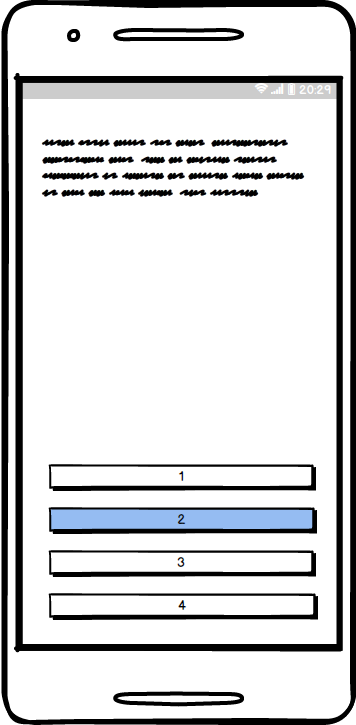
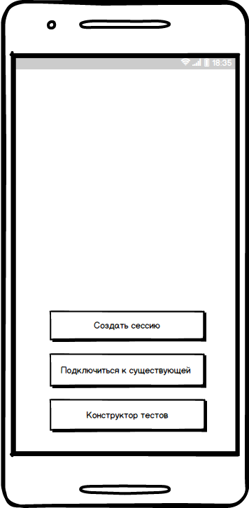

---

# Содержание
1 [Ведение](#intro)  
1.1 [Назначение](#purpose)  
1.2 [Бизнес-требования](#scope)  
1.3 [Глоссарий](#glossary)  
1.4 [Обзор аналогов](#analogues)  
2 [Требования](#requirements)  
2.1 [Программные требования](#software_requirements)    
2.2 [Технические требования](#hardware_requirements)  
2.3 [Интерфейс пользователя](#user_requirements)  
2.4 [Характеристики пользователя](#user_characteristics)  
2.5 [Предположения и зависимости](#assumptions_and_dependensies)  
3 [Системные требования](#system_requirements)  
3.1 [Функциональные требования](#functional_requirements)  
3.2 [Нефункциональные требования](#nonfunctional_requirements)  
3.2.1	[Атрибуты качества](#quality_attributes)  
3.2.2	[Ограничения](#constrains)  

<a name="intro"/>

# 1 Введение

<a name="purpose"/>

## 1.1 Назначение
В этом документе приведены обзор и описание приложения "Eastory 2.0". Так же будут представлены требования, предъявленные как в самому приложению, так и к среде, в которой оно будет выполняться.

<a name="scope"/>

## 1.2 Бизнес-требования

Приложение предназначено для проверки своих знаний по истории Беларуси и(или) подготовке к Централизованному тестированию по данной отрасли исторической науки. Приложение должно содержать тестовые задания с текстовым или графическим материалом. Будет представлена возможность пройти как комплексный тест, так и тест по отдельному историческому периоду. Для использования преподавателями в школах должна быть реализована возможность разворачивания на одном устройстве хоста для создания сети для тестирования.     

<a name="glossary"/>

## 1.3 Глоссарий
* User (пользователь) — человек, использующий приложение.
* Eastory — название приложения.
* Тест — очередная сессия пользователя.
* Тестовое задание — текстовый вопрос(или текстовый вопрос к графическому изображению) с предложенными вариантами ответа.

<a name="analogues"/>

## 1.4 Обзор аналогов
 Приложение является уникальным в линейке себе подобных из-за специализации на истории нашей любимой Родины.

<a name="requirements"/>

# 2 Требования

<a name="software_requirements"/>

## 2.1 Программные требования
* приложение должно быть написано на языке Java;
* для написания приложения в качестве IDE будет использоваться Android Studio, которое предоставит приложению все необходимые программные интерфейсы; 
* использование СУБД SQLite;

<a name="user_requirements"/>

## 2.2 Интерфейс пользователя
  
  
  
 Функция |Действие 
--- | :-: 
Начать тестирование |Нажать на соответствующую кнопку
Сетевое взаимодействие |Нажать на соответствующую кнопку
Смена языка |Нажать на соответствующую кнопку

 
Функция |Действие 
--- | :-: 
Выбрать ответ |Нажать на кнопку с соответствующим вариантом

Функция |Действие 
--- | :-: 
Создать сессию |Нажать на соответствующую кнопку
Подключиться к хосту |Нажать на соответствующую кнопку
Открыть конструктор тестов |Нажать на соответствующую кнопку

<a name="user_characteristics"/>

## 2.3 Характеристики пользователя

Приложение предназначено для учащихся средних школ, желающих проверить свои знания по учебной дисциплине, а также для преподавателей истории, которые смогут оценивать знания учащихся без муторной проверки бумажек. С стороны пользователей требуются минимальные навыки пользования мобильным устройством c ОС Android.  

<a name="assumptions_and_dependencies"/>

## 2.4 Предположения и зависимости
Для использования части функционала приложения необходимо соединение с интернетом.

<a name="system_requirements"/>

# 3 Системные требования

<a name="functional_requirements"/>

## 3.1 Функциональные требования

<a name="stations_list"/>
Приложение предоставляет пользователю следующие возможности: 

* Выбор варианта тестирования(комплексного или по периоду);
* Получение оценки выполненного теста;
* Возвращение к заданиям, где пользователь допустил ошибку, с показом правильного ответа.
* Создания на устройстве хоста, к которому могут подключаться другие устройства.
* Конструктор тестов

<a name="non-functional_requirements"/>

## 3.2 Нефункциональные требования

<a name="quality_attributes"/>

### 3.2.1 Атрибуты качества
* Большое количество заданий;
* Наличие белорусского языка.

<a name="constrains"/>

### 3.2.2 Ограничения
* Приложение доступно для устройств под управлением Android 4.4 (API v19) и выше.
